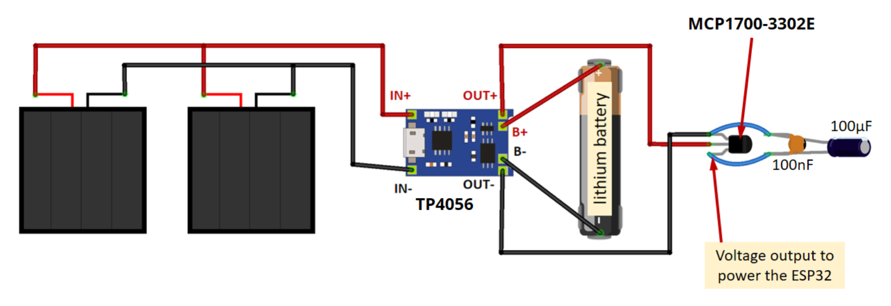
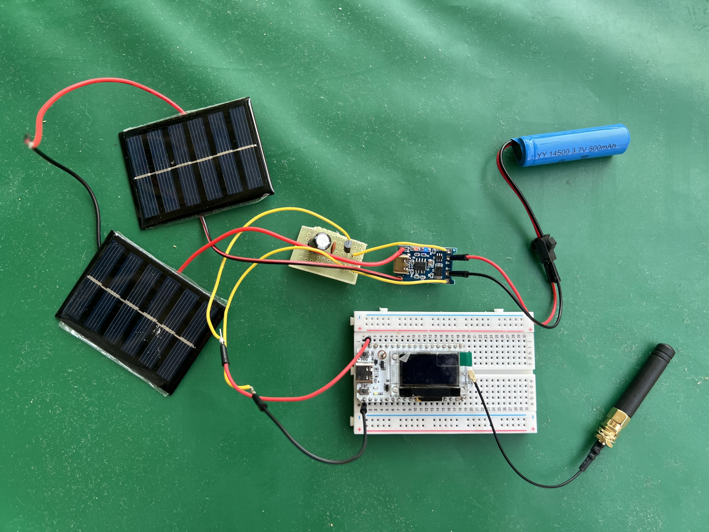
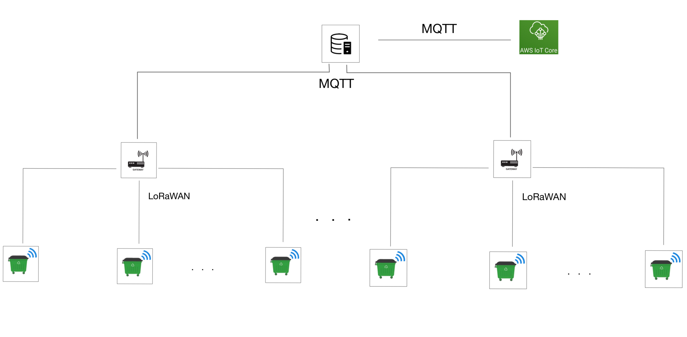
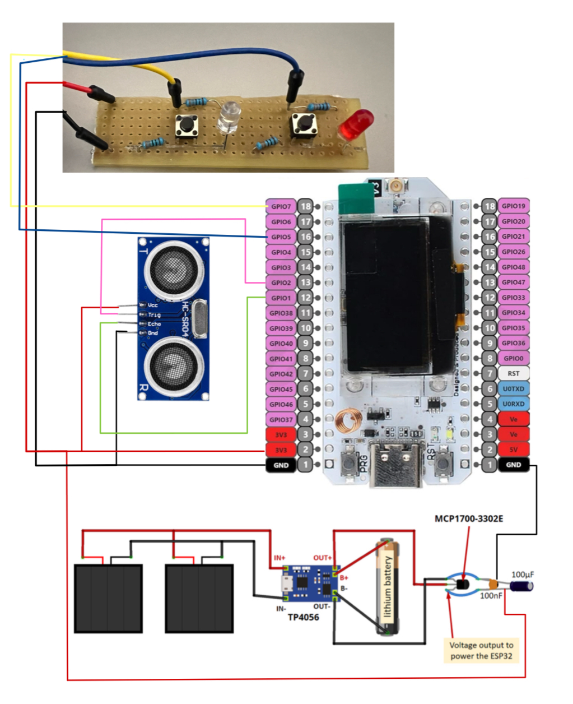

# Bidoncini

## Team

[De Risi Simona](https://www.linkedin.com/in/simona-de-risi-5a8087234/)

[Zerpa Ruiz Josef Emanuele](https://www.linkedin.com/in/zerparuiz/)

## Project description

The aim of this project is to develop a network of IOT devices monitoring the usage of trash dumpsters. Such devices would measure the amount of trash collected by each trash dumpster, reporting it to a central server. Data would be used to organize collection routes, scheduling a dumpster for collection only when it is full or "almost full", optimizing trash collection. By analyzing the data, it will be possible to understand the average use of the trash dumpsters, quantitavely define a fullness threshold, hence defining when a can is "almost full". This usage observation could also be repeated periodically, to detect potential seasonal changes to the use of the dumpsters, and react accordingly. Moreover, statistical analysis could show most frequently used dumpsters, more active areas, which could serve to consider dumpster reallocation, to better serve the public space.

## Presentation

[Google slides](https://docs.google.com/presentation/d/1_4GwrutNBIYwXp_CGsLgpOWbdoYZVEuwucl5qhpxUG0/edit?usp=sharing)

## Twin project and media coverage

[Roma Today - I nuovi cestoni di Roma sono eco e tecnologici.](https://www.romatoday.it/politica/cestoni-getta-carte-intelligenti-roma.html)

[Comune di Roma - Presentati i nuovi cestoni intelligenti](https://www.comune.roma.it/web/it/notizia/presentati-i-nuovi-cestoni-intelligenti-.page)

# Project development

## Energy harvesting

We equipped out project with an energy harvesting system making use of solar panels. 

For this, we needed a battery to store the energy, a charging module to regulate the voltage and current generated by the solar panels and charge the battery, a voltage regulator and some capacitors to build a regulating circuit providing a stable and fixed voltage to the esp32 board. 

For the battery we got a 3.7 V [battery](https://www.power-xtra.com/uploads/content/900600503251-dspdf.pdf?v=1561451363) with 800 mAh. The [solar panels](https://www.amazon.it/GTIWUNG-Pannello-Cellule-Progetti-Scientifici/dp/B097GS2CL8?th=1) chosen provided 3 V with 0.1 Amp each. By placing them in parallel we were able to obtain 6 V of output with 0.1 A. Checking the battery data sheet we saw that the standard charging amperage was 0.16 A, so our setup was actually able to vahrge the battery. By placing more solar panels in series we could further increase the charging current hence charging speed. But this is not strictly necessary for the project.

For the charging module we got a [TP4056](https://dlnmh9ip6v2uc.cloudfront.net/datasheets/Prototyping/TP4056.pdf) integrated circuit. This grabs energy produced by the solar panels, regulates voltage and current depending on battery charging level. Keeping input to battery under safety ranges.

Finally, the esp32 board needs a constant and fixed current at 3.3 V. The [MCP1700](https://ww1.microchip.com/downloads/en/DeviceDoc/MCP1700-Low-Quiescent-Current-LDO-20001826E.pdf) is a voltage regulator that specifically achieves this. Receiving an input voltage from 6 to 2.3 V, it produces a stable output at 3.3 V. This ensures all internal components of the esp32 operate safely.

## Architecture
The whole architecture is the following:

### The sensor
The sensors inside each trash bin measure the fullness of the can and then sends the distance measured inside a LoRaWAN packet. The packet will contain the tuple (ID, distance) in a JSON format to simplify the future processings. The structure of the payload is: `{“id”: <id>, “distance”: <distance>}`.
Once that the distance has been measured, the sensor will go in deep sleep.
The sensor is powered through solar panels. 
More details about the energy harvesting and the deep sleep can be found in the previous section of this README.

###The gateway
Scattered throughout the territory there are LoRaWAN gateways that receive the packets generated by the sensors in the trash bins. The gateways have also a Wifi connection and can send the packets through MQTT to a central server.

###The central server
The central server will receive the packets from the various gateways, and then send the packets, adding a timestamp, to AWS IoT Core (always through MQTT). To be able to talk with AWS, there is the need to have some certificates installed that certify who you are and obviously these certificates are personal. More details about how to install them to be able to run the central server are in the README inside the `project/central_server` directory.

###AWS
AWS IoT Core has a rule that takes the packets and save the triples (ID, distance, timestamp) inside a DynamoDB.
With all the values in the database then it is possible to compute the optimal path for the trash collection.

## Frequency analysis

## Energy consumption

## Conclusions

## Credits

[Energy harvesting tutorial](https://randomnerdtutorials.com/power-esp32-esp8266-solar-panels-battery-level-monitoring/)

[Push button logic](https://esp32tutorials.com/esp32-push-button-esp-idf-digital-input/?authuser=0)

[Deep Sleep ESP-IDF](https://docs.espressif.com/projects/esp-idf/en/stable/esp32s3/api-reference/system/sleep_modes.html)

