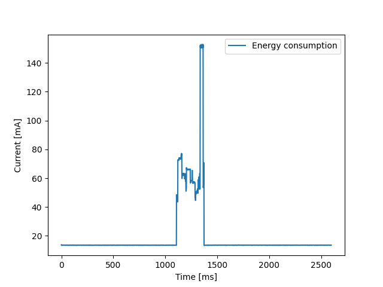

# Bidoncini

## Team

[De Risi Simona](https://www.linkedin.com/in/simona-de-risi-5a8087234/)

[Zerpa Ruiz Josef Emanuele](https://www.linkedin.com/in/zerparuiz/)

## Project description

The aim of this project is to develop a network of IOT devices monitoring the usage of trash dumpsters. Such devices would measure the amount of trash collected by each trash dumpster, reporting it to a central server. Data would be used to organize collection routes, scheduling a dumpster for collection only when it is full or "almost full", optimizing trash collection. By analyzing the data, it will be possible to understand the average use of the trash dumpsters, quantitavely define a fullness threshold, hence defining when a can is "almost full". This usage observation could also be repeated periodically, to detect potential seasonal changes to the use of the dumpsters, and react accordingly. Moreover, statistical analysis could show most frequently used dumpsters, more active areas, which could serve to consider dumpster reallocation, to better serve the public space.

## Presentation

[Google slides](https://docs.google.com/presentation/d/1_4GwrutNBIYwXp_CGsLgpOWbdoYZVEuwucl5qhpxUG0/edit?usp=sharing)

## Twin project and media coverage

[Roma Today - I nuovi cestoni di Roma sono eco e tecnologici.](https://www.romatoday.it/politica/cestoni-getta-carte-intelligenti-roma.html)

[Comune di Roma - Presentati i nuovi cestoni intelligenti](https://www.comune.roma.it/web/it/notizia/presentati-i-nuovi-cestoni-intelligenti-.page)

# Project development

## Energy harvesting

We equipped out project with an energy harvesting system making use of solar panels. 

For this, we needed a battery to store the energy, a charging module to regulate the voltage and current generated by the solar panels and charge the battery, a voltage regulator and some capacitors to build a regulating circuit providing a stable and fixed voltage to the esp32 board. 

For the battery we got a 3.7 V [battery](https://www.power-xtra.com/uploads/content/900600503251-dspdf.pdf?v=1561451363) with 800 mAh. The [solar panels](https://www.amazon.it/GTIWUNG-Pannello-Cellule-Progetti-Scientifici/dp/B097GS2CL8?th=1) chosen provided 3 V with 0.1 Amp each. By placing them in parallel we were able to obtain 6 V of output with 0.1 A. Checking the battery data sheet we saw that the standard charging amperage was 0.16 A, so our setup was actually able to vahrge the battery. By placing more solar panels in series we could further increase the charging current hence charging speed. But this is not strictly necessary for the project.

For the charging module we got a [TP4056](https://dlnmh9ip6v2uc.cloudfront.net/datasheets/Prototyping/TP4056.pdf) integrated circuit. This grabs energy produced by the solar panels, regulates voltage and current depending on battery charging level. Keeping input to battery under safety ranges.

Finally, the esp32 board needs a constant and fixed current at 3.3 V. The [MCP1700](https://ww1.microchip.com/downloads/en/DeviceDoc/MCP1700-Low-Quiescent-Current-LDO-20001826E.pdf) is a voltage regulator that specifically achieves this. Receiving an input voltage from 6 to 2.3 V, it produces a stable output at 3.3 V. This ensures all internal components of the esp32 operate safely.

## Architecture
The whole architecture is the following:

### The sensor
The sensors inside each trash bin measure the fullness of the can and then sends the distance measured inside a LoRaWAN packet. The packet will contain the tuple (ID, distance) in a JSON format to simplify the future processings. The structure of the payload is: `{“id”: <id>, “distance”: <distance>}`.
Once that the distance has been measured, the sensor will go in deep sleep.
The sensor is powered through solar panels. 
More details about the energy harvesting and the deep sleep can be found in the previous section of this README.

### The gateway
Scattered throughout the territory there are LoRaWAN gateways that receive the packets generated by the sensors in the trash bins. The gateways have also a Wifi connection and can send the packets through MQTT to a central server.

### The central server
The central server will receive the packets from the various gateways, and then send the packets, adding a timestamp, to AWS IoT Core (always through MQTT). To be able to talk with AWS, there is the need to have some certificates installed that certify who you are and obviously these certificates are personal. More details about how to install them to be able to run the central server are in the README inside the `project/central_server` directory.

### AWS
AWS IoT Core has a rule that takes the packets and save the triples (ID, distance, timestamp) inside a DynamoDB.
With all the values in the database then it is possible to compute the optimal path for the trash collection.

## Security
Considering the MQTT connection secured by asymmetric encryption, both between the gateway and the server, and the server and aws cloud, the only open communication was the Lora link between the endpoints.
We have thought of implementing a cryptographic protocol on top of the Lora communication, to ensure confidentiality of the packets, as well as identification of the endpoint from the gateway.

The protocol consists of the use of [Elliptic Curve Cryptography](https://www.wolfssl.com/documentation/manuals/wolfssl/group__Curve25519.html) to produce pair of keys to encrypt the messages. Then the packet forwarded from the endpoint to the gateway, containing the sensor value, becomes { endpoint_id; encrypted(sensor_value) }. At time of setup, the endpoint gets configured with the public key of the gateway. The endpoint produces its own pair of keys, saves its private key in memory, and prints out the public key. Through a [secure and external communication](https://esp32io.com/tutorials/esp32-mysql?utm_content=cmp-true) the public key of the newly installed device gets uploaded to the gateway, eg. added to a database available to the gateway. In such a way, the gateway, when receiving a packet, can read the endpoint id, find its public key in its id-public_key storage, and decrypt the message. Now, the gateway is sure that the message was actually sent by the declared endpoint, eg. the message cannot be spoofed, and the comunication is secured from eavesdropping, eg. confidential. 

In case of physical capture of the endpoint, the communication is one-way, endpoint to gateway, so an adversary could only forge fake messages. Spoofed messages, signed with a spoofed id, would get dropped since the decryption would not output any sensible information at the gateway point. A flood of messages instead could be stopped by then deactivating the respective id.

We developed such encryption protocol on top of the lora communication makeing use of the [WolfSSL library](https://www.wolfssl.com).

## Frequency analysis
*How to understand which is the right time interval between measurements?* This is a tough question because on one hand we want to take measurements very often to have an higher granularity and so more probability to collect the trash at the right time, on the other hand we want to measure the less possible to save energy.
Furthermore the frequency of measurements depends also on the area. We expect that a trash bin in the center of Rome or in a very populated area fulls faster than a trash bin more isolated.

For this reason we implemented a functionality on the device in which the bin sets autonomously its time between measurements. Practically the first time that the sensor is activated, it will do measurements every 30 minutes (which is way faster of the expected time of whatever bin), it counts how many measurements it does before being full. Once the bin is full it sets the time between measurements as 1/4 of the total time.

*But the filling speed can change overtime!* For this reason the device will continuously check how many measurements it has done since the last emptying  and until being full. If the bin has fullen up faster or slower than expected we update the sleep time between measurements. (Obvioulsy to detect an acceleration or a decelaration in the filling speed there are some tolerance  margins).

To let the sensor know that it has been emptied, the operator will press a button that will wake up the device, hence the sensor will reset the number of measurements.

## Energy consumption

To measure energy consumption we used the INA219 module. Using an external arduino, we were able to query the module and measure the current flowing through the alimentation cable.

We plotted the measurements for the activities of the endpoint. The endpoint is the only device deployed in the wild. Gateway and central server should be installed in safe and controlled environments, with stable current input.

With the use of serial tool [miniterm](https://pyserial.readthedocs.io/en/latest/tools.html) we were able to get the current values from the arduino to a text file. The pyhton script under 'scripts' plots this values into the images shown. The other python script sums up the current values, giving us a indication of the current spent under a specific duty cycle. It also tell us how long the duty cycle lasted, in milliseconds.

As explained, the current consumption on active sleep, e.g. task delay, is:

**mAmperes\*ms drawn:** 20899.099999999984

**duty cycle in ms:** 322

**average mA:** 64.9040372670807

During the sleep cycle the device consumes a fixed value of around 46.7 mA.

Considering a sensing operation every 2 hours, the duty cycle has a proportion relative to the sleep cycle of:
0.322 / (2 * 60) = 0.003

Hence the average consumption of a full cycle becomes:
64.7 * 0.003 + 46.7 * 0.997 = 46.754

The duty cycle is so small relative to the time under sleep that its contribution to the consumption is negligible.

The current consumption for the endpoint on deep sleep instead is:

**mAmperes\*ms drawn:** 18697.60000000001

**duty cycle in ms:** 265

**average mA:** 70.5569811320755

During the sleep cycle the device consumes an average of 13.6 mA.

The same consideration of the small impact of the duty cycle on the consumption is valid here too.

The selected battery has a capcity of 800 mAh, a max Voltage of 4.2, and cut off discharge Voltage of 2.75. [Battery Datasheet](https://www.power-xtra.com/uploads/content/900600503251-dspdf.pdf?v=1561451363)

The consumable energy is:

800 mAh * ( 1 - ( 2.75 V / 4.2 V ) ) = 282 mAh

- about ( 282 mAh / 46 mA ) = 6.13 h for active sleep.

- about ( 282 mAh / 14 mA ) = 20.14 h for deep sleep.

With the energy harvesting system implemented in our project, we have a constant flow of 100 mA to recharge the battery during sun time. The charged battery would not be able to withstand the dark hours, if the firmware didn't makeuse of the deep sleep functionality. Thanks to deep sleep, the battery life can go up to a 228% increase. Battery life is more than three-fold.

As per the charging module [datasheet](https://dlnmh9ip6v2uc.cloudfront.net/datasheets/Prototyping/TP4056.pdf), the battery would take around 1.75 hours to fully charge from fully discharged, with a max current of 800 mAh. Our current system has a max charging current of 100 mA. Charging current could be improved by placing more solar panels in parallel, or by using better efficiency panels. Even though, the supply of 100 mA is over the average estimated consumption of our system. As built, the system could technically go on forever. Naturally, battery decay would eventually stop the experiment.

## Credits

[Energy harvesting tutorial](https://randomnerdtutorials.com/power-esp32-esp8266-solar-panels-battery-level-monitoring/)

[Push button logic](https://esp32tutorials.com/esp32-push-button-esp-idf-digital-input/?authuser=0)

[Deep Sleep ESP-IDF](https://docs.espressif.com/projects/esp-idf/en/stable/esp32s3/api-reference/system/sleep_modes.html)

[Lora on Esp32s3](https://github.com/nopnop2002/esp-idf-sx126x)

[Encryption on Esp32](https://github.com/StefanoMilani/FreeRTOS-security-tutorial/tree/master)

[Energy consumption with INA219](https://learn.adafruit.com/adafruit-ina219-current-sensor-breakout/arduino-code)

[Battery lif math](https://www.omnicalculator.com/other/battery-life#)

